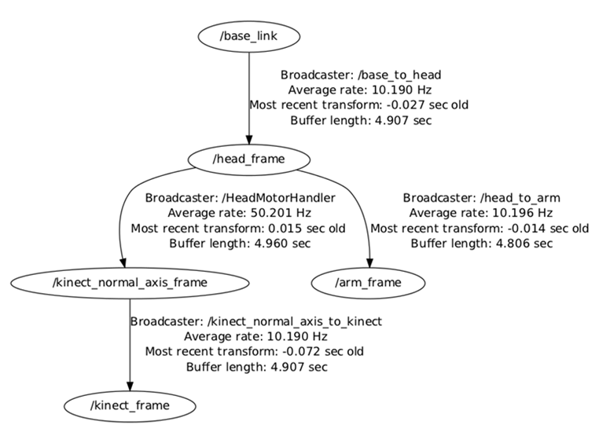
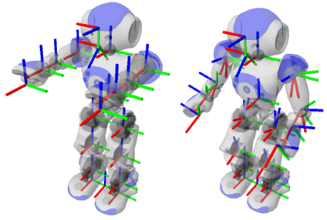
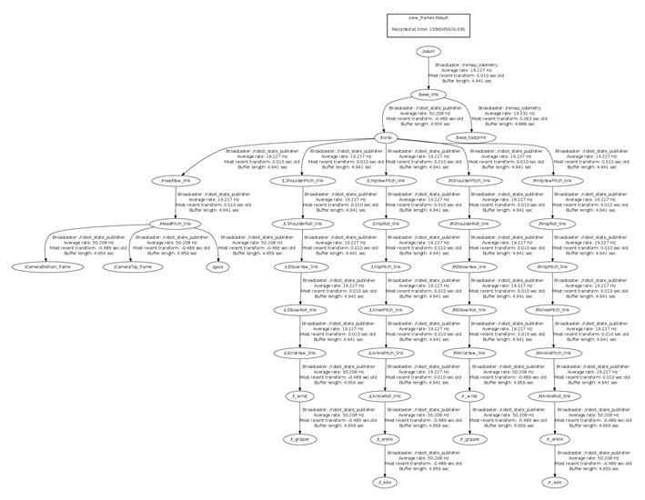
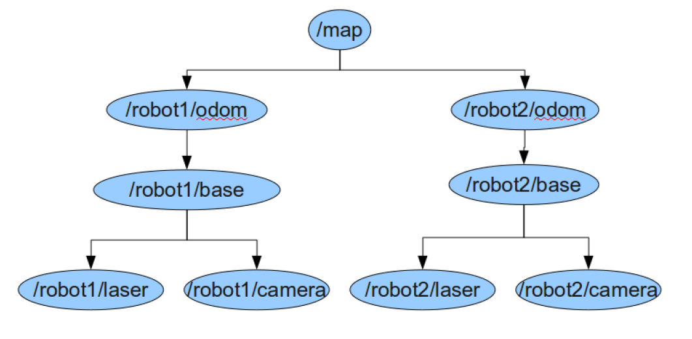
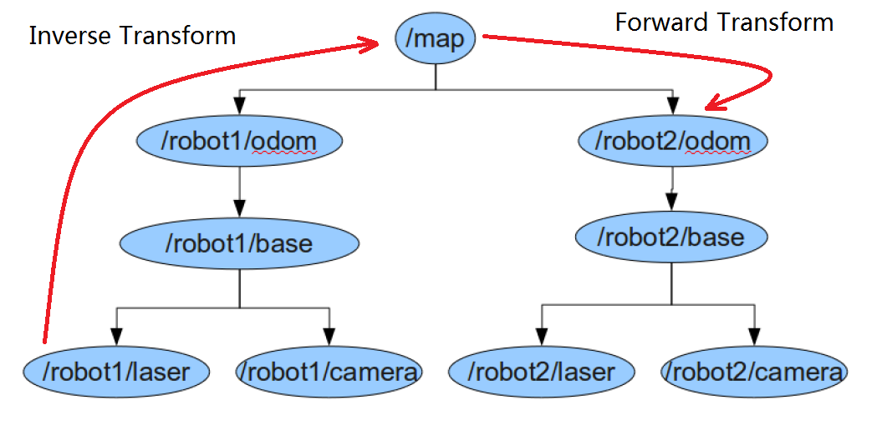

# ROS教程——1.6 如何使用TF变换

### 1.6.1 ROS变换系统（TF）

##### （1）TF简介

**什么是TF**。机器人系统通常具有许多随时间变化的坐标系，例如世界坐标系、基座坐标系、夹持器坐标系、头部坐标系等。TF是一个变换系统，它允许在一个坐标系中进行计算，然后在任何所需的时间点将它们转换到另一个坐标系。TF能够回答以下问题：地图坐标系中机器人基座的当前位姿是什么？相对于机器人基座，夹持器中物体的位姿是什么？5秒前，头部坐标系在世界坐标系的什么地方？

**TF的优点**。分布式系统，即没有单点故障；转换多次时没有数据丢失；没有坐标系之间的中间数据转换的计算成本；用户无需担心其数据的起始坐标系；有关过去位置的信息进行存储并且可访问（在本地记录开始后）。

**TF节点**。有两种类型的tf节点：发布器 - 发布坐标系之间的变换转换到/tf；订阅器 - 订阅/ tf并缓存所有数据直至缓存极限。

**TF变换树**。TF在坐标系之间构建变换树，支持多个非连接树，仅在同一树中变换有效，见图1。



<center>图1 Transform Tree</center>
**变换树示例**。如图2-图3，即为Nao机器人的TF变换树。



<center>图2 Nao机器人及其坐标系</center>


<center>图3 Nao机器人的变换树</center>
##### （2）如何使用TF树

假设我们希望robot2根据robot1的激光数据进行导航，给定TF树，见图4-图5。



<center>图4 如何使用TF</center>


<center>图5 Inverse Transform and Forward Transform</center>
**TF Demo**。根据如下命令，启动turtle_tf_demo：

```bash
$ roslaunch turtle_tf turtle_tf_demo.launch
```

现在，我们可以看到，在一个窗口中的两只乌龟，一只跟随着另一只。

该启动文件的内容如下：

```html
<launch>

  <!-- Turtlesim Node-->
  <node pkg="turtlesim" type="turtlesim_node" name="sim"/>

  <node pkg="turtlesim" type="turtle_teleop_key" name="teleop" output="screen"/>
  <!-- Axes -->
  <param name="scale_linear" value="2" type="double"/>
  <param name="scale_angular" value="2" type="double"/>

  <node name="turtle1_tf_broadcaster" pkg="turtle_tf" type="turtle_tf_broadcaster.py" respawn="false" output="screen" >
    <param name="turtle" type="string" value="turtle1" />
  </node>
  <node name="turtle2_tf_broadcaster" pkg="turtle_tf" type="turtle_tf_broadcaster.py" respawn="false" output="screen" >
    <param name="turtle" type="string" value="turtle2" />
  </node>
  <node name="turtle_pointer" pkg="turtle_tf" type="turtle_tf_listener.py" respawn="false" output="screen" >
  </node>

</launch>
```

由此可知，同时启动了turtle_tf_listener和turtle_teleop_key，因此，使用键盘箭头键在turtlesim中驱使一开始就位于中心的乌龟，示例轨迹如下：

<div align=center></div>
<div align=center>图6 TF Demo</div>
该Demo使用TF库创建3个坐标系，分别是世界坐标系、turtle1坐标系和turtle2坐标系；包含一个TF广播器（broadcaster）发布turtle坐标系，一个TF订阅器（listener）计算两个turtle坐标系之间的距离。

##### （3）TF命令行工具

**view_frames**：可视化完整的坐标变换树；

通过view_frames创建一个由TF使用ROS广播的坐标系变换树：

<div align=center></div>
<div align=center>图7 运行view_frames</div>

查看该变换树的命令如下：

```bash
$ evince frames.pdf
```

<div align=center></div>
<div align=center>图8 查看变换数</div>

**tf_monitor**：监视坐标系之间的变换；

打印当前坐标系变换树信息到控制台:

<div align=center></div>
<div align=center>图9(a) tf_monitor</div>

**tf_echo**：将指定的变换输出到屏幕；

tf_echo通过ROS广播任意两个坐标系之间的变换，使用示例：

```bash
$ rosrun tf tf_echo [reference_frame] [target_frame]
```

让我们看一下turtle2坐标系相对于turtle1坐标系的变换，它相当于：
$$
T_{turtle1\_turtle2} = T_{turtle1\_world} * T_{world\_turtle2}
$$
命令如下：

```bash
$ rosrun tf tf_echo turtle1 turtle2
```

当驱动乌龟时，TF变换将随着两只乌龟相对移动而改变：

<div align=center></div>
<div align=center>图9(b) tf echo</div>

**roswtf**：使用tfwtf插件，帮助我们跟踪TF的问题；

**static_transform_publisher**：一个用于发送静态变换的命令行工具。

##### （4）旋转的表示

旋转有多种表示方式：

欧拉角：分别绕Z、Y和X轴的偏航角、俯仰角和滚转角；
旋转矩阵；
四元数；

<div align=center></div>
<div align=center>图10 旋转的表示</div>
**四元数**

在数学中，四元数是一个扩展复数的数字系统，四元数乘法的基本公式（Hamilton，1843）：
$$
i^2 = j^2 = k^2 = ijk = −1
$$
四元数可用于理论和应用数学，特别是涉及3D旋转的计算，例如计算机图形和计算机视觉。

**四元数和空间旋转**

3D中的任何旋转都可以表示为矢量$\vec{u}$（欧拉轴）和标量$\theta$（旋转角度）的组合；
围绕某个轴经过角度$\theta$的旋转可由单位矢量定义：
$$
\vec{u}(u_x,u_y,u_z)=u_x\bold{i},u_y\bold{j},u_z\bold{k}
$$
该四元数表示为：

$$
\bold{q}=e^{\theta(u_x\bold{i}+u_y\bold{j}+u_z\bold{k})}=cos\frac{1}{2}\theta+(u_x\bold{i}+u_y\bold{j}+u_z\bold{k})sin\frac{1}{2}\theta
$$
四元数提供了一种简单的方法，用4个数字表示绕轴旋转的角度，可以使用简单的公式将相应的旋转应用于位置矢量：
http://en.wikipedia.org/wiki/Quaternions_and_spatial_rotation

使用四元数的优点：非奇异性、比矩阵更紧凑（和更快）。

##### （5）rviz和tf

让我们用rviz来看看上述示例中乌龟坐标系
通过rviz的-d选项，使用turtle_tf配置文件启动rviz：

```bash
$ rosrun rviz rviz -d `rospack find turtle_tf`/rviz/turtle_rviz.rviz
```

在左侧栏中，您将看到由tf广播的坐标系；

请注意，固定坐标系是/world，不随时间移动；

当驱动乌龟时，发现rviz中的坐标系发生了变化，在左侧栏选中"Show Names"和"Show Arrows"将更加直观。

<div align=center></div>
<div align=center>图11 rviz和tf</div>
##### （6）广播变换

TF广播器将坐标系的相对位姿发送给系统的其余部分，一个系统可以有多个广播器，每个广播器提供机器人不同部分的信息。接下来，我们将编写代码来重现上述tf Demo。

**写一个广播器**。首先创建一个名为lecture1-6的新包，它依赖于tf，roscpp，rospy和turtlesim:

```bash
$ cd ~/catkin_ws/src/ros_tutorial/
$ catkin_create_pkg lecture1-6 tf roscpp rospy turtlesim
```

在`lecture1-6/src`添加一个名为tf_broadcaster.cpp的新源文件，内容如下:

```c++
#include <ros/ros.h>
#include <tf/transform_broadcaster.h>
#include <turtlesim/Pose.h>

std::string turtle_name;

void poseCallback(const turtlesim::PoseConstPtr& msg){
    static tf::TransformBroadcaster br;
    tf::Transform transform;
    transform.setOrigin(tf::Vector3(msg->x, msg->y, 0.0));
    tf::Quaternion quaternion;
    transform.setRotation(tf::createQuaternionFromYaw(msg->theta));
    br.sendTransform(tf::StampedTransform(transform, ros::Time::now(), "world", turtle_name));
}

int main(int argc, char** argv){
    ros::init(argc, argv, "my_tf_broadcaster");
    if (argc != 2) {
      ROS_ERROR("need turtle name as argument");
      return -1;
    };
    turtle_name = argv[1];

    ros::NodeHandle node;
    ros::Subscriber sub = node.subscribe(turtle_name+"/pose", 10, &poseCallback);

    ros::spin();
    return 0;
};
```

**发送变换**

使用TransformBroadcaster发送变换需要4个参数：
变换对象；
时间戳，通常我们用当前时间，ros::Time::now()；
所创建链接的父坐标系名称，在本例中为“world”；
所创建链接的子坐标系名称，本例中为乌龟本身名称。

示例如下：

```c++
br.sendTransform(tf::StampedTransform(transform, ros::Time::now(), "world", turtle_name));
```

**创建并运行广播器**

在CMakeLists.txt文件中插入：

```html
add_executable(tf_broadcaster src/tf_broadcaster.cpp)
target_link_libraries(tf_broadcaster   ${catkin_LIBRARIES})
```

通过catkin_make构建包:

```bash
$ cd ~/catkin_ws/
$ catkin_make
```

在`/lecture1-6/launch`下创建启动文件`tf_demo.launch`，文件内容如下:

```html
<launch>
    <!-- Turtlesim Node-->
    <node pkg="turtlesim" type="turtlesim_node" name="sim"/>
    <node pkg="turtlesim" type="turtle_teleop_key" name="teleop" output="screen"/>

    <!-- tf broadcaster node -->
    <node pkg="lecture1-6" type="tf_broadcaster"
          args="/turtle1" name="turtle1_tf_broadcaster" />
  </launch>
```

运行启动文件：

```bash
$ cd ~/catkin_ws/src
$ roslaunch lecture1-6 tf_demo.launch
```

**检查结果**

使用tf_echo工具检查乌龟位姿是否发布到tf

```bash
$ rosrun tf tf_echo /world /turtle1
```

<div align=center></div>
<div align=center>图12 检查结果</div>
##### （7）监听TF变换

TF监听器接收并缓存在系统中广播的所有坐标系，并查询坐标系之间的指定变换，接下来我们将创建一个TF监听器，它将监听来自TF广播器的变换，使用以下代码将tf_listener.cpp添加到`lecture1-6/src`中:

```c++
#include <ros/ros.h>
#include <tf/transform_listener.h>
#include <turtlesim/Spawn.h>
#include <geometry_msgs/Twist.h>

int main(int argc, char** argv){
    ros::init(argc, argv, "tf_listener");

    ros::NodeHandle node;

    ros::service::waitForService("spawn");
    ros::ServiceClient add_turtle =
       node.serviceClient<turtlesim::Spawn>("spawn");
    turtlesim::Spawn srv;
    add_turtle.call(srv);

    ros::Publisher turtle_vel =
       node.advertise<geometry_msgs::Twist>("turtle2/cmd_vel", 10);

    tf::TransformListener listener;
    ros::Rate rate(10.0);

    while (node.ok()){
        tf::StampedTransform transform;
        try {
            listener.waitForTransform("/turtle2", "/turtle1", ros::Time(0), ros::Duration(10.0) );
            listener.lookupTransform("/turtle2", "/turtle1", ros::Time(0), transform);
        } catch (tf::TransformException &ex) {
            ROS_ERROR("%s",ex.what());
        }

        geometry_msgs::Twist vel_msg;
        vel_msg.angular.z = 4 * atan2(transform.getOrigin().y(),
                                     transform.getOrigin().x());
        vel_msg.linear.x = 0.5 * sqrt(pow(transform.getOrigin().x(), 2) +
                                      pow(transform.getOrigin().y(), 2));

        turtle_vel.publish(vel_msg);

        rate.sleep();
    }
    return 0;
};
```

**代码简述**，要使用TransformListener，我们需要包含tf / transform_listener.h头文件；一旦创建了监听器，它就开始接收变换，并缓存最近10秒钟的变换信息；TransformListener对象应限定为持久化，否则其缓存将无法填充，几乎每个查询都将失败；一种常见的方法是使TransformListener对象成为类的成员变量。

**TransformListener的核心方法**：LookupTransform(), WaitForTransform(), CanTransform()。

LookupTransform(): 获取两个坐标系之间的变换;

要查询侦听器以获取指定变换，需要传递4个参数：
变换源自哪个坐标系；
变换的目标坐标系；
想要的变换的时间。 提供ros :: Time(0)将提供最新的变换。
存储变换结果的对象。

例如：

```c++
listener.lookupTransform("/turtle2", "/turtle1", ros::Time(0), transform);
```

WaitForTransform(): 等待直到超时或转换可用;

CanTransform(): 测试变换是否为坐标框系之间进行转换。

**创建并运行监听器**

将以下行添加到`lecture1-6/CMakeLists.txt`:

```html
add_executable(tf_listener src/tf_listener.cpp)
target_link_libraries(tf_listener   ${catkin_LIBRARIES})
```

通过调用catkin_make来构建包: 

```bash
$ cd ~/catkin_ws
$ catkin_make
```

Launch 文件

将以下行添加到`lecture1-6/tf_demo.launch`:

```html
    <!-- Second broadcaster node -->
    <node pkg="lecture1-6" type="tf_broadcaster"
          args="/turtle2" name="turtle2_tf_broadcaster" />
          
    <!-- tf listener node -->
    <node pkg="lecture1-6" type="tf_listener" name="listener" />
```

此时的`tf_demo.launch`文件:

```html
<launch>
    <!-- Turtlesim Node-->
    <node pkg="turtlesim" type="turtlesim_node" name="sim"/>
    <node pkg="turtlesim" type="turtle_teleop_key" name="teleop" output="screen"/>

    <!-- tf broadcaster node -->
    <node pkg="lecture1-6" type="tf_broadcaster"
          args="/turtle1" name="turtle1_tf_broadcaster" />
          
    <!-- Second broadcaster node -->
    <node pkg="lecture1-6" type="tf_broadcaster"
          args="/turtle2" name="turtle2_tf_broadcaster" />
          
    <!-- tf listener node -->
    <node pkg="lecture1-6" type="tf_listener" name="listener" />
</launch>
```
**检查结果**

要查看是否有效，只需使用箭头键驱动第一只乌龟（确保终端窗口处于活动状态，而不是模拟器窗口），然后您将看到第二只乌龟跟随第一只乌龟。对比*（2）如何使用TF树*可知通过代码实现了相应的功能。

### 1.6.2 获取机器人定位信息

**典型的TF坐标系**

<div align=center></div>
<div align=center>图13 典型的TF坐标系</div>

*odom*: 仅使用测距测量的自洽坐标系;
*base_footprint*: 机器人在地面以上零高度的基础;
*base_link*: 机器人的基座，位于机器人旋转中心;
*base_laser_link*: 激光传感器的位置;

**Turtlebot TF坐标系**

<div align=center></div>
<div align=center>图14 Turtleot的TF坐标系</div>
现在，我们通过一个示例，演示如何使用TF确定机器人在世界坐标系的当前位置。首先，更改Gazebo中TurtleBot的初始位置（默认为x = 0，y = 0），我们通过设置环境变量ROBOT_INITIAL_POSE来更改初始位置，例如：

```bash
export ROBOT_INITIAL_POSE="-x -1 -y -2"
```

要使机器人处于其自己坐标系中的位置（即，相对于其在地图上的起始位置），创建一个从/map坐标系到/base_footprint坐标系的监听器，代码如下：

```c++
#include <ros/ros.h>
#include <tf/transform_listener.h>

using namespace std;

int main(int argc, char** argv){
    ros::init(argc, argv, "robot_location");
    ros::NodeHandle node;

    tf::TransformListener listener;
    ros::Rate rate(2.0);

    listener.waitForTransform("/map", "/base_footprint", ros::Time(0), ros::Duration(10.0) );

    while (ros::ok()){
        tf::StampedTransform transform;
        try {

            listener.lookupTransform("/map", "/base_footprint", ros::Time(0), transform);
            double x = transform.getOrigin().x();
            double y = transform.getOrigin().y();

            cout << "Current position: (" << x << "," << y << ")" << endl;
        } catch (tf::TransformException &ex) {
            ROS_ERROR("%s",ex.what());
        }
        rate.sleep();
    }
    return 0;
}
```


**静态变换发布者**

为了获取机器人在全局坐标系中的位置，需要由某个节点发布map-> odom变换；
此变换通常由ROS的地图构建节点或定位节点之一发布（下一教程）；
在假设机器人的定位准确时，可以在这些坐标系之间发布静态（固定）变换：

```html
<launch>
  <!-- Publish a static transformation between /map and /odom -->
  <node name="tf" pkg="tf" type="static_transform_publisher" args="-1 -2 0 0 0 0 /map /odom 100" />
</launch>
```

监听从/map到/base_footprint的变换，以便在地图坐标系获取机器人的位置：

```C++
    while (ros::ok()){
        tf::StampedTransform transform;
        try {            
            listener.lookupTransform("/map", "/base_footprint", ros::Time(0), transform);
            double x = transform.getOrigin().x();
            double y = transform.getOrigin().y(); 
            cout << "Current position: (" << x << "," << y << ")" << endl;
        } catch (tf::TransformException &ex) {
            ROS_ERROR("%s",ex.what());
        }
        rate.sleep();
    } 
```

<div align=center></div>
<div align=center>图15 新的TF变换树</div>

```html
<launch>
  <param name="/use_sim_time" value="true"/>  

  <!-- Run Gazebo with turtlebot -->
  <include file="$(find turtlebot_gazebo)/launch/turtlebot_world.launch"/>

  <!-- Publish a static transformation between /odom and /map -->
  <node name="tf" pkg="tf" type="static_transform_publisher" args="-1 -2 0 0 0 0 /map /odom 100" />

  <!-- Run node -->
  <node name="robot_location" pkg="lecture1-6" type="robot_location" output="screen" />

</launch>
```

在`lecture1-6/CMakeLists.txt`文件中加入：

```html
add_executable(robot_location src/robot_location.cpp)
target_link_libraries(robot_location ${catkin_LIBRARIES})
```

使用`catkin_make`创建包：

```bash
$ cd ~/catkin_ws/
$ catkin_make
```

启动: 

```bash
 $ roslaunch lecture1-6 robot_location.launch 
```


<div align=center></div>

<div align=center>图16 Turtleot的TF坐标系</div>

**在rviz中查看TF变换**
运行rviz 

```bash
$ roslaunch turtlebot_rviz_launchers view_robot.launch
```
单击`TF`复选框

<div align=center></div>

<div align=center>图17 在rviz中查看TF变换</div>

### 1.6.3 练习

（1）编写函数，将机器人在世界中的当前位置（x，y）转换为机器人网格图中所在的位置单元格坐标（i，j），反之亦然；此处，考虑地图分辨率。
（2）输出机器人初始单元格位置。